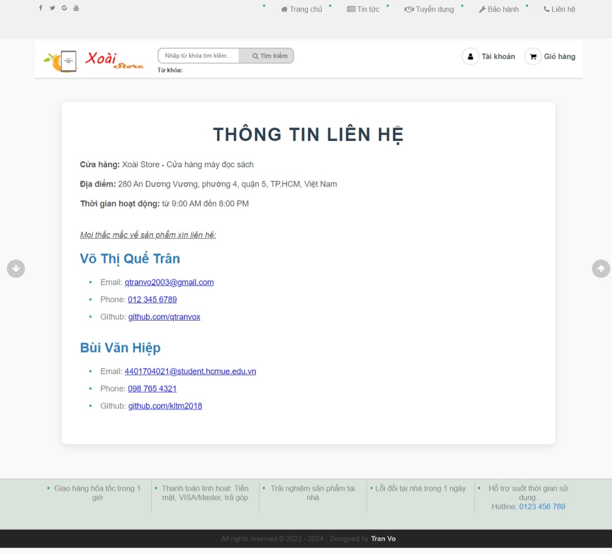

# E-Reader Online Store Website

## Project Overview
This is an e-commerce website built to sell e-readers, allowing users to browse products, manage their shopping cart, and review products. The platform includes a user-friendly admin panel for managing users, products, and orders, as well as powerful search and statistics features. 

## Authors
This project was developed by:
- **[Vo Thi Que Tran]** - [@qtranvox](https://github.com/qtranvox) 
- **[Bui Van Hiep]** - [@kltm2018](https://github.com/kltm2018)

## Features

### Admin Panel:
- **User Management**: Admins can log in, update user information, and log out. Passwords are securely hashed to protect user privacy.
- **Product Management**: Admins can update product details such as price, description, and availability.
- **Invoice Management**: Admins can update invoice records and process orders, ensuring smooth operations.
- **Statistics**: The website includes a dashboard that provides key business insights, such as product quantities and sales figures.

### User Features:
- **Search Functionality**: Users can search for products using keywords, product names, or filter by price range.
- **Product Reviews**: Customers can leave reviews for products and rate them based on their experience.
- **Shopping Cart**: Users can add products to their cart for later purchase.
- **Checkout (Under Development)**: The checkout and payment processing feature is currently being built.

### Images





## Getting Started
To run the project locally, clone the repository and set up a local server with PHP and MySQL. Ensure that the database is correctly configured for full functionality.

### Installation Steps:
1. Clone the repository:
   ```
   git clone https://github.com/kltm2018/E-readerSalesWebsite.git
2. Set up a local server with PHP (XAMPP, WAMP, etc.).
3. Import the database from `doan.sql` into MySQL.
4. Run the website on your local server.

### Contributing
If you would like to contribute to the project, feel free to open a pull request or submit issues. Contributions are always welcome!

### Support Us
If you find this project useful, please consider giving us a star on GitHub ⭐!
